AprendeMath - Grupo 4 ✏️📚
La aplicación AprendeMath está diseñada para ayudar a los usuarios a aprender matemáticas de manera sencilla y efectiva. A través de lecciones interactivas, ejercicios dinámicos y desafíos adaptados al nivel de cada estudiante, AprendeMath convierte el estudio de las matemáticas en una experiencia accesible y motivadora.

La plataforma integra módulos de práctica 📈, evaluaciones automáticas 🧠, y recursos de apoyo visual 🖼️, permitiendo a los usuarios consolidar conceptos clave de forma práctica y divertida. Además, cuenta con un sistema de retroalimentación instantánea para reforzar el aprendizaje en tiempo real.

# 2025-1 Programación Movil - Quiz
Este aplicativo móv- [Configuración del Ambiente de Desarrollo](#configuración-del-ambiente-de-desarrollo)
## Configuración del Ambiente de Desarrollo
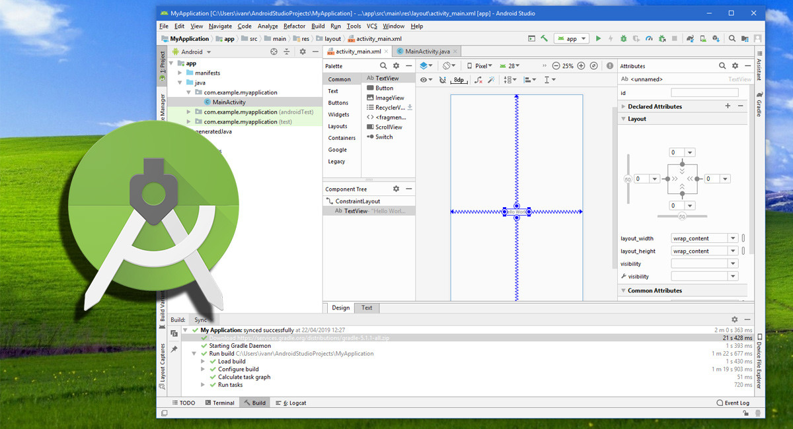

*Figura 1: Instalacion de Android Studio*

# Diagrama de Despliegue:

Nuestro Diagrama de despliegue muestra una arquitectura distribuida en donde el usuario interactua en una app movil (AprendeMath) que sera en diapositivos Android, donde se ejecutara un protocolo HTTPS, con un servicio de  con un servicio backend desplegado en Azure App Service, que procesa las solicitudes y ejecuta la lógica de negocio. A su vez, el backend consulta y almacena la información en una base de datos Azure SQL Database denominada "dataPrograMovil", mediante conexiones internas seguras dentro de la nube de Azure. 

*<b>Figura 2:</b> Diagrama de Despliegue*

# Requerimientos No funcionales:
Los requerimientos no funcionales definen las características de calidad que debe cumplir el aplicativo móvil AprendeMath para garantizar su correcto funcionamiento durante el desarrollo y evaluación académica.

- **Seguridad:**  
  La aplicación debe utilizar el protocolo **HTTPS** para todas las comunicaciones. Las contraseñas deben almacenarse aplicando cifrado básico para evitar su almacenamiento en texto plano.

- **Rendimiento:**  
  El tiempo de respuesta para las principales acciones (**inicio de sesión**, **carga de módulos**, **confirmación de respuestas**) no debe exceder los **7 segundos** bajo condiciones normales de uso.

- **Disponibilidad:**  
  La aplicación debe estar disponible de manera continua, permitiendo **reinicios manuales** en caso de fallas técnicas.

- **Usabilidad:**  
  El proceso de **registro** de un nuevo usuario debe completarse en un tiempo máximo de **3 minutos**, y el usuario debe poder iniciar su primer **quiz** en menos de **6 minutos** sin necesidad de asistencia.

- **Compatibilidad:**  
  La aplicación debe ser compatible con dispositivos Android que utilicen la versión **8.0 (Oreo)** o superior, y adaptarse correctamente a diferentes tipos de pantallas entre **5 y 10 pulgadas**.

- **Recuperación ante errores:**  
  En caso de **errores de conexión** o **fallos de servidor**, la aplicación debe notificar al usuario e intentar restablecer la acción de manera sencilla.

# Diagrama de Casos de Uso:

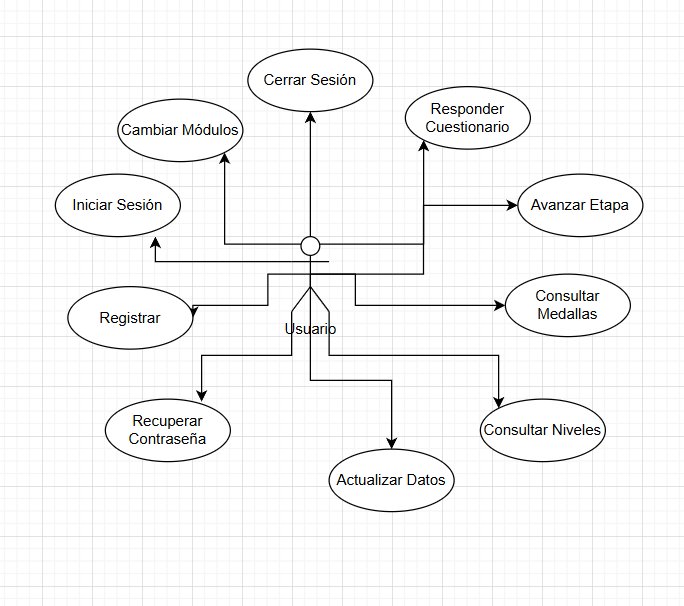

*<b>Figura 3:</b> Diagrama de Casos de Uso*
# Descripción de Casos de Uso:
### 1.**Iniciar Sesión**
Permite al usuario autenticarse ingresando sus credenciales para acceder a su cuenta.
  
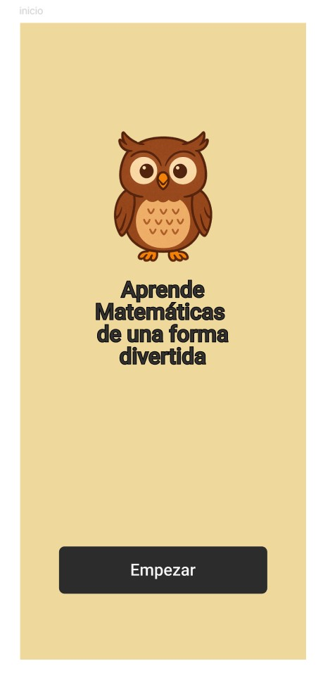
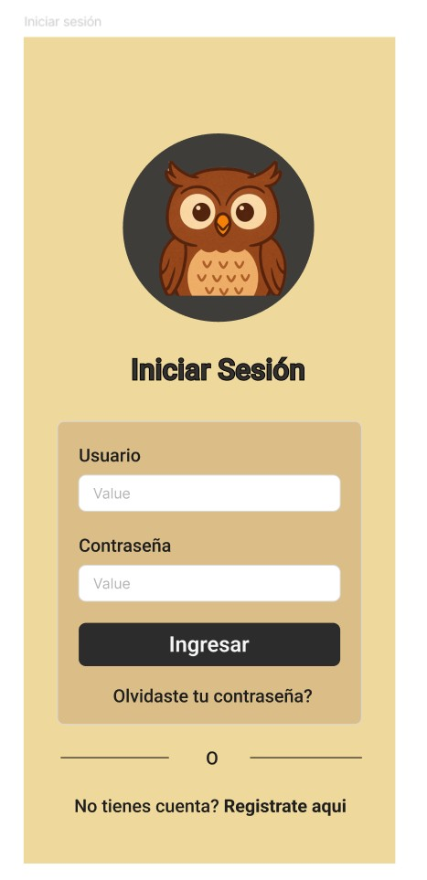
### 2.**Registrar**
Permite al usuario crear un nuevo registro proporcionando sus datos personales y de acceso.
  

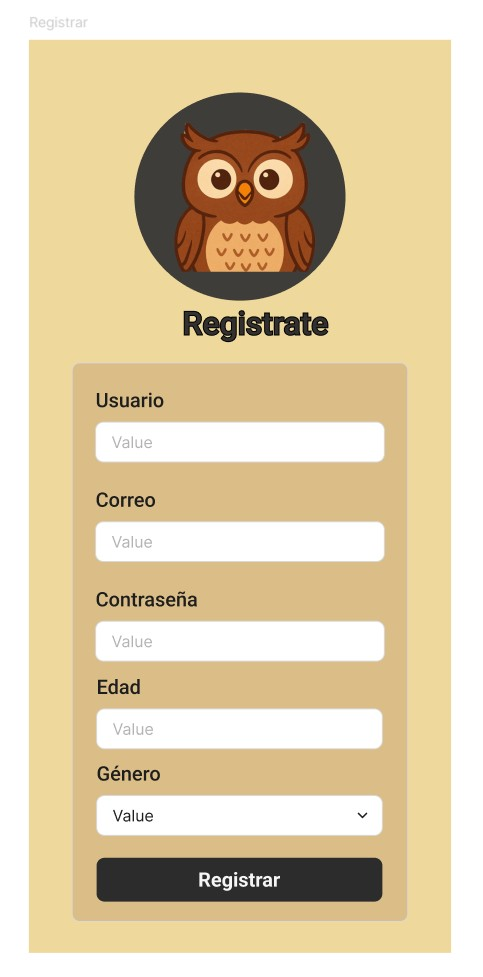
### 3.**Recuperar Contraseña**
Permite al usuario recuperar el acceso a su cuenta mediante un correo de restablecimiento de contraseña.
  

### 3.**Consultar Niveles:**
Permite al usuario ver los niveles o secciones superadas dentro de la aplicación educativa y poder inciar los diferentes niveles en la sección.
  
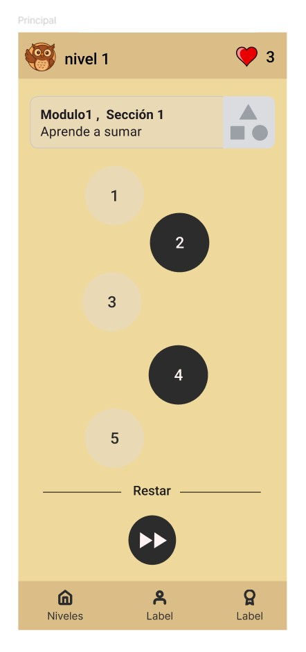
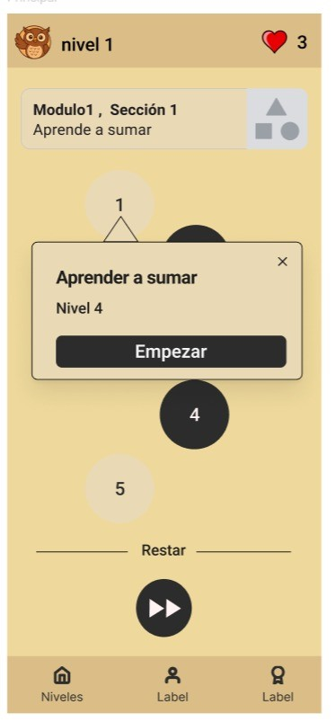
### 4.**Cambiar Módulos:**
Permite al usuario seleccionar entre diferentes módulos de aprendizaje solo si los tienes debloqueados.
  

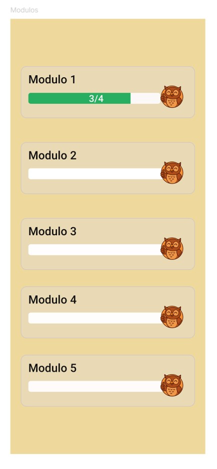
### 5.**Responder Cuestionario:**
Permite al usuario seleccionar una respuesta dentro de las evaluaciones o cuestionarios y enviar su respuesta seleccionada y recibir retroalimentación sobre su validez.
  
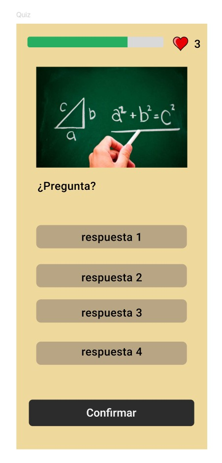
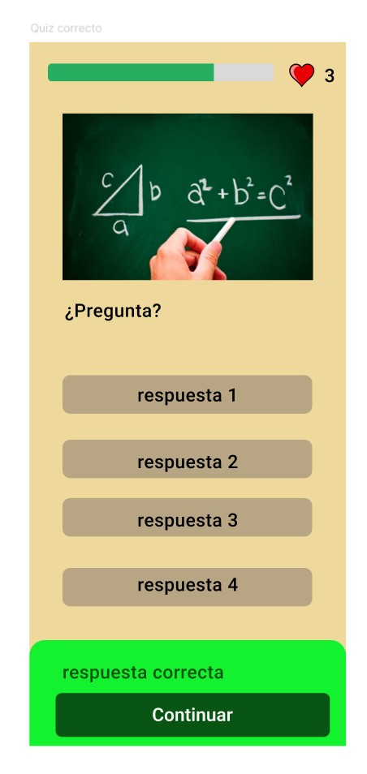
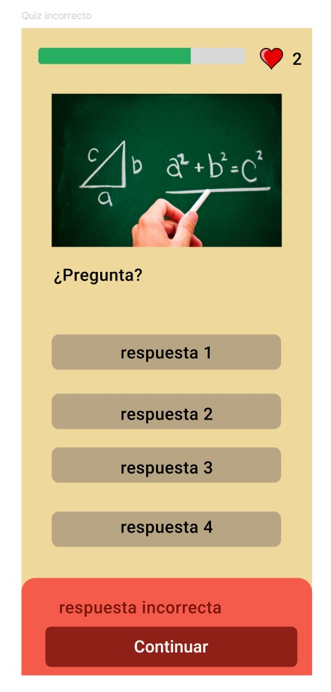
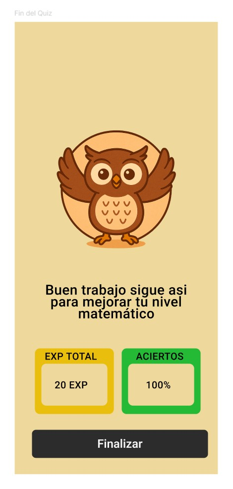
### 6.**Avanzar Etapa:**
Permite al usuario avanzar a una sección o modulo bloqueado desarrollando un examen en base a la sección o módulo seleccionado.
  

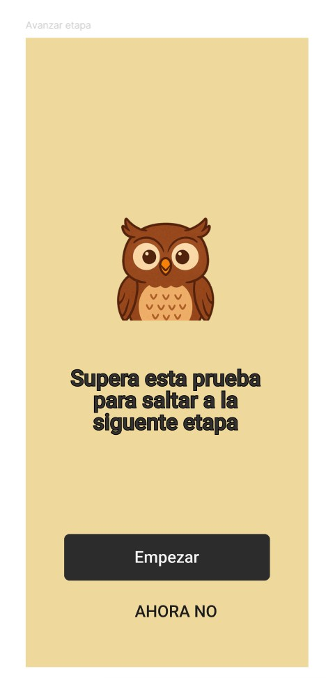
### 6.**Actualizar Datos:**
Permite al usuario modificar sus datos de perfil, como nombre, correo electrónico o foto.
  
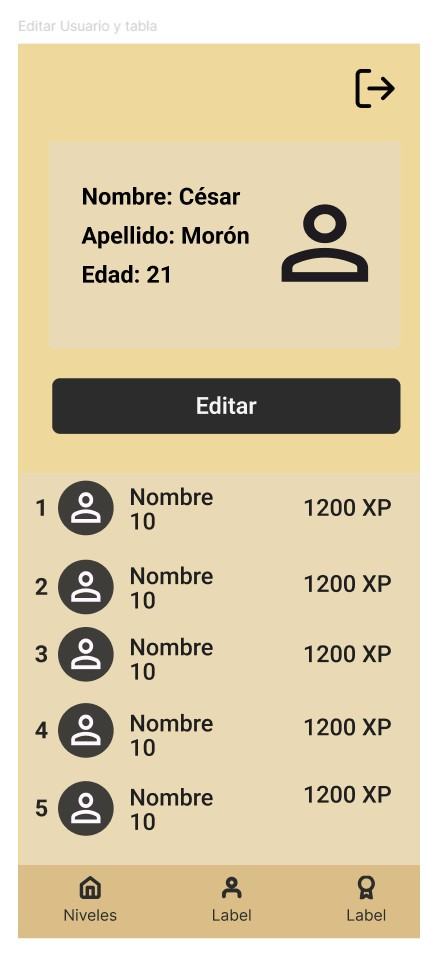
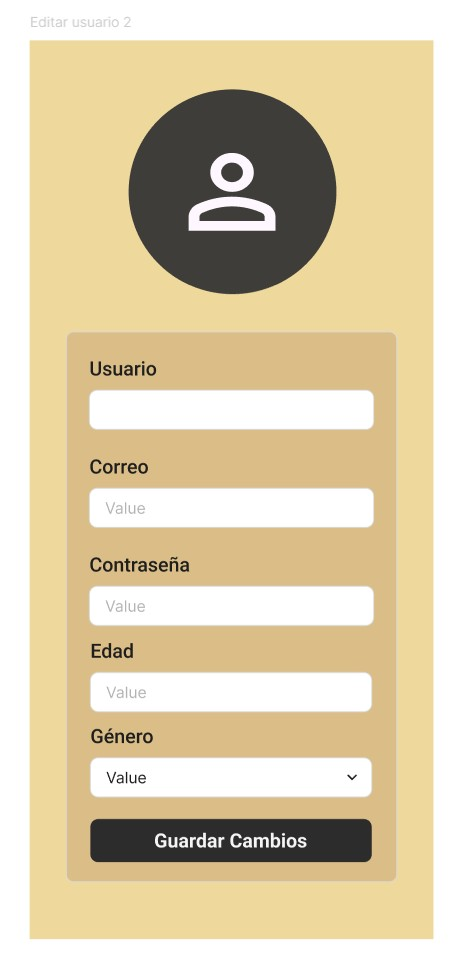
### 7.**Cerrar Sesión:** 
Permite al usuario salir de su cuenta de forma segura, cerrando su sesión actual.
  

### 8.**Consultar Medallas:**
Permite al usuario visualizar las medallas obtenidas por su rendimiento y logros alcanzados.
  
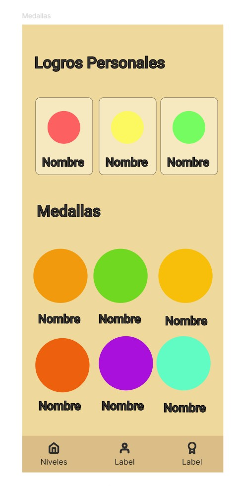

